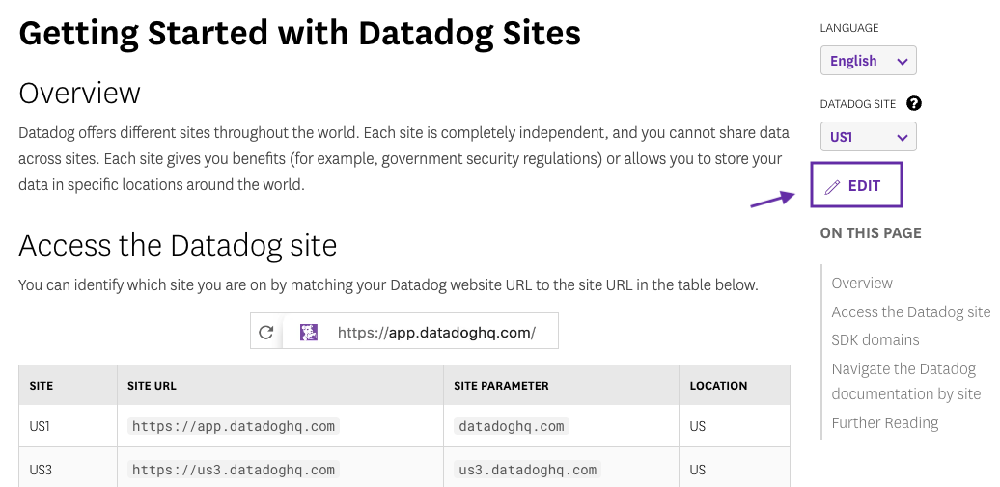

# Documentation site for Datadog

Welcome to the Datadog documentation repository. The markdown stored in this repo is published to the [Datadog documentation site][17] using [hugo][1], a static website generation tool.

## Contribute to the docs

Contributions are encouraged! If you notice something on one of the pages that needs an edit, open a pull request in this repo for the documentation team to review

Most pages on the documentation site feature an **Edit** button that sends you to the source file in this repo. You can make an edit straight from the GitHub website!

For more information on contributing, see the [contribution guidelines][18].

## Working on Docs

### Datadog Staff

- Always branch off of master; never commit directly to master.
- Name your branch `<SLACK_HANDLE>/<FEATURE_NAME>`. If you don’t use this convention, the Gitlab pipeline won’t run and you won’t get a branch preview. Getting a branch preview makes it easier for us to check for any issues with your PR, such as broken links.
- Consult our [contributing guidelines][8].
- When you're ready to commit, create a new pull request to master from your branch.
- Use GitHub's [draft pull request][15] feature and appropriate labels such as "Do Not Merge" or "Work in Progress" until your PR is ready to be merged and live on production.
- If you've named your branch correctly, a GitHub bot posts a link to the docs preview website for your PR. After the preview build completes, you can use the link to preview your changes.
- To run the build locally, see [Docs Build][20]. This is an optional step and requires setup.

### Outside Contributors

- Fork the master branch.
- Consult our [contributing guidelines][8].
- When you're ready to finalize your changes, commit them and make a pull request back to `DataDog/master`.
- A Datadog technical writer might change your PR title with a DOCS ticket number, such as "[DOCS-9000]," which means it has been added to the team's internal Jira queue to triage and review. No action is necessary from you if we change the title of your PR.

### A note about markdown

This site uses [Goldmark][9] for markdown, which is compliant with [CommonMark 0.29][10].

If you include ANY Markdown in a file, give it a `.md` extension.

Make sure all files are lowercase. Macs are case-insensitive when creating links to images and pages, but our build server is not, so tests may work locally, but the site will fail in production.

## Releasing

Within 10 minutes of merging to master, it deploys automatically.

## How to add a new integration

[See the dedicated doc page][11].

[1]: https://gohugo.io
[2]: https://nodejs.org/en/download/package-manager#macos
[3]: https://www.python.org/downloads
[4]: https://github.com/pyenv/pyenv#unixmacos
[5]: https://github.com/DataDog/documentation/blob/master/Makefile.config.example
[6]: https://github.com/DataDog/documentation/wiki/Github-personal-token
[7]: https://github.com/DataDog/documentation/wiki/Documentation-Build
[8]: https://github.com/DataDog/documentation/blob/master/CONTRIBUTING.md
[9]: https://github.com/yuin/goldmark
[10]: https://spec.commonmark.org/0.29/
[11]: https://docs.datadoghq.com/developers/integrations
[12]: https://www.docker.com/products/docker-desktop/
[13]: https://gohugo.io/getting-started/installing/
[14]: https://golang.org/doc/install
[15]: https://github.blog/2019-02-14-introducing-draft-pull-requests/
[16]: https://github.com/DataDog/documentation#docker-development
[17]: https://docs.datadoghq.com
[18]: /CONTRIBUTING.md
[19]: https://docs.github.com/en/authentication/connecting-to-github-with-ssh/adding-a-new-ssh-key-to-your-github-account
[20]: https://datadoghq.atlassian.net/wiki/spaces/docs4docs/pages/2231206099/Docs+Build#Local-builds
