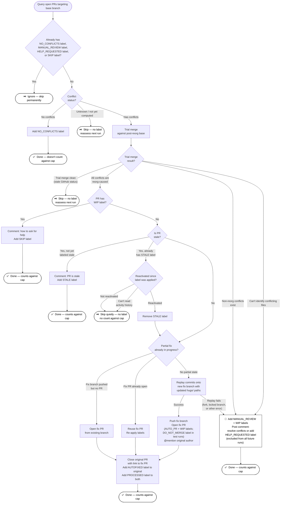

# PR handling details

How the conflict-resolution script decides what to do with each open PR after the repo reorg (which moved root files and folders into `hugo/`). This describes the behavior in plain terms; the script itself is the source of truth.

## Labels used

| Label | Applied to | Meaning |
|-------|-----------|---------|
| `LABEL_NO_CONFLICTS` | original PR | PR merges cleanly after the reorg; ignored from then on. |
| `LABEL_MANUAL_REVIEW` | original PR | Conflicts that can't be fixed automatically; queued for a person. Ignored from then on. Applied together with `LABEL_WIP` and a comment (see [Sending a PR to manual review](#sending-a-pr-to-manual-review)). |
| `LABEL_STALE` | original PR | PR had no activity for more than `STALE_DAYS`; skipped instead of auto-fixed. |
| `LABEL_AUTOFIXED` | original PR | PR was auto-fixed; the original is closed and points to a new fix PR. |
| `LABEL_AUTO_PR` | new fix PR | Marks the automatically created fix PR. |
| `LABEL_HELP_REQUESTED` | original PR (added by the author) | The author is asking a person to step in on an already-processed PR they're still stuck on. The script leaves these PRs alone. |
| `LABEL_WIP` | original PR (added by the author) | Author marked the PR as not ready; it gets a comment and is then skipped. |
| `LABEL_SKIP` | original PR | Applied by the script after commenting on a work-in-progress PR, so later runs don't pick it up again. |
| `LABEL_PROCESSED` | every PR the script acts on | Visibility aid so all reorg-affected PRs are findable with one filter, regardless of outcome. Not used for idempotency and deliberately absent from the query. |
| `DO_NOT_MERGE_LABEL` | new fix PR (test runs only) | Keeps auto-created fix PRs out of other teams' review queues. |

Key thresholds:
- `STALE_DAYS` (31) — a PR with no activity for longer than this is treated as stale (roughly one calendar month).
- `STALE_REACTIVATE_GRACE` (60 seconds) — a small allowance so the script's own labeling of a PR is never mistaken for the author reactivating it.

## Which PRs are considered

By default the script looks at every **open** PR targeting the base branch (`master`, or a mock base branch during test runs), but **ignores** any PR that already carries `LABEL_NO_CONFLICTS`, `LABEL_MANUAL_REVIEW`, `LABEL_HELP_REQUESTED`, or `LABEL_SKIP`. `LABEL_NO_CONFLICTS` and `LABEL_MANUAL_REVIEW` are final: once a PR has one, it's never looked at again. `LABEL_HELP_REQUESTED` is added by an author who wants a person to take over, so the script stops touching the PR and leaves it for manual handling. `LABEL_SKIP` is applied by the script after it comments on a work-in-progress PR, so it isn't picked up and re-commented on later.

You can also point the script at specific PR numbers instead of the whole open list. In that mode it will also consider closed PRs, but it still skips any PR that targets a different base branch.

## Decision flow

For each PR, in order. The first case that matches wins.

### 1. The PR has no conflicts

Label it `LABEL_NO_CONFLICTS` and move on. This is how PRs that are opened *after* the reorg reaches master get ignored going forward. Labeling a clean PR doesn't count against the run's processing limit.

### 2. GitHub hasn't figured out yet whether the PR conflicts

Skip it for now, with no label or comment. GitHub computes this in the background, so a later run will pick it up once the answer is available.

### 3. The PR has conflicts

The script does a trial merge against the post-reorg base and sorts each conflict into two buckets: conflicts **caused by the reorg** (a file the reorg moved) and conflicts **unrelated to the reorg**. It also catches files the PR adds at an old, pre-reorg location that should now live under `hugo/`, and counts those as reorg conflicts.

What happens next depends on what it found:

#### 3a. No conflicts could actually be pinned down
- If the trial merge failed but the script couldn't identify which files conflicted (an unusual case), it plays it safe and [sends the PR to manual review](#sending-a-pr-to-manual-review) rather than guessing.
- If the trial merge was clean after all, GitHub's earlier "conflicting" status was probably out of date; the PR is skipped so a later run can reassess.

#### 3b. Some conflicts are unrelated to the reorg

The script never touches conflicts it didn't cause. It [sends the PR to manual review](#sending-a-pr-to-manual-review) and leaves it for a person.

#### 3c. All conflicts were caused by the reorg

Before fixing anything, the PR has to be "ready." These checks run in order.

**Work in progress** — If the PR is marked `LABEL_WIP`, the script posts a comment telling the author how to ask for help, adds `LABEL_SKIP`, and skips the fix. Because `LABEL_SKIP` is excluded from the query, later runs won't pick the PR up again, so the comment is posted only once.

**Stale** — See [Stale handling](#stale-handling) below.

**Auto-fix** — If the PR is ready and every conflict came from the reorg, the script fixes it:
- It replays the PR's commits onto a new fix branch with all file paths moved to the new `hugo/` layout, keeping the original authorship and commit messages.
- If that succeeds, it opens a new fix PR (labeled `LABEL_AUTO_PR` and `LABEL_WIP`, plus `DO_NOT_MERGE_LABEL` on test runs), then closes the original PR with a comment linking to the fix and labels the original `LABEL_AUTOFIXED`. Every PR the script acts on — including this one — also receives `LABEL_PROCESSED`. The fix PR's description **@mentions the original author**, so they're notified the moment it's opened (which is before the original is closed — see [Resuming an interrupted fix](#resuming-an-interrupted-fix)).
- If the fix can't be applied — for example the PR comes from a fork the script can't push to, or the replay fails — it [sends the PR to manual review](#sending-a-pr-to-manual-review).

### Resuming an interrupted fix

The auto-fix happens in stages: push the fix branch, open the fix PR, then close the original. If a run dies in between (a network blip, an interrupted process), a later run detects the partial state and **finishes the job** instead of bailing:

- **Fix PR already open:** the script reuses it — re-applies its labels, then closes the original pointing at it and labels the original `LABEL_AUTOFIXED`.
- **Fix branch pushed but no PR:** the script opens the PR from the existing branch, then finishes as above.

It never rebuilds or force-pushes an existing fix branch, so a fix already in review is never clobbered. If it truly can't build the branch (for instance it's checked out in a lingering worktree), it falls back to [manual review](#sending-a-pr-to-manual-review). Because the fix PR's description @mentions the author, they learn about the fix even if the original close step never ran.

### Sending a PR to manual review

Every non-auto-fixable outcome (a non-reorg conflict, an unclassifiable merge failure, or a failed replay) is handled the same way: the script applies `LABEL_MANUAL_REVIEW` (which excludes the PR from all future runs), applies `LABEL_WIP` (which keeps it out of the docs team's review queue until the author acts), and posts a single comment explaining the situation. The comment tells the author to resolve the conflicts and then remove the `WORK IN PROGRESS` label, or to add `LABEL_HELP_REQUESTED` if they'd rather a person take over.

## Stale handling

A PR is **stale** when its last activity was more than `STALE_DAYS` ago. Stale handling only applies to PRs whose conflicts all came from the reorg.

**If a stale PR isn't labeled stale yet:** the script posts a comment explaining that no action was taken because the PR is stale (and how to ask for help), then adds the `LABEL_STALE` label.

**If a PR already has the `LABEL_STALE` label:** the label serves two purposes — it marks the PR as stale, and it prevents the same comment from being posted again. Deciding whether the PR has "woken up" is based on whether there's been activity *since the label was applied* — not simply on how old the last activity is. This matters because the script's own comment and label count as activity; without this rule, a PR the script just labeled would look active again on the very next run and get fixed anyway.

So for a PR that already has the stale label:
- The PR is considered **reactivated** if there was genuine activity (a new commit, a comment, or removing the stale label) after the label was applied — allowing for the `STALE_REACTIVATE_GRACE` window so the labeling itself doesn't count.
- **If it hasn't been reactivated:** skip it quietly, without commenting again. The skip lasts across runs until a person interacts with the PR.
- **If it has been reactivated:** remove the `LABEL_STALE` label and handle the PR normally (it goes on to the auto-fix step).
- **If the activity history can't be read** for some reason, the PR is treated as *not* reactivated and stays skipped, so a temporary glitch won't cause an unexpected auto-fix.

### How an author reactivates a stale PR
- Push a new commit or leave a comment, **or**
- Remove the `LABEL_STALE` label (removing a label also counts as activity).

To instead ask a person to step in rather than have the script retry, the author adds `LABEL_HELP_REQUESTED`; the script then leaves the PR alone (see [Labels used](#labels-used)).

## Limiting a run and dry runs
- A run can be capped to act on only a set number of PRs. A PR counts against that cap when it's auto-fixed or gets a review/stale label and comment. PRs that need no action — clean PRs, ones GitHub hasn't evaluated, or ones that turn out clean on the trial merge — don't count.
- By default the script only reports what it *would* do, without changing anything, and runs against a mock base branch for safety. There are flags to apply changes for real and to run against the real `master`.

## State machine diagram

