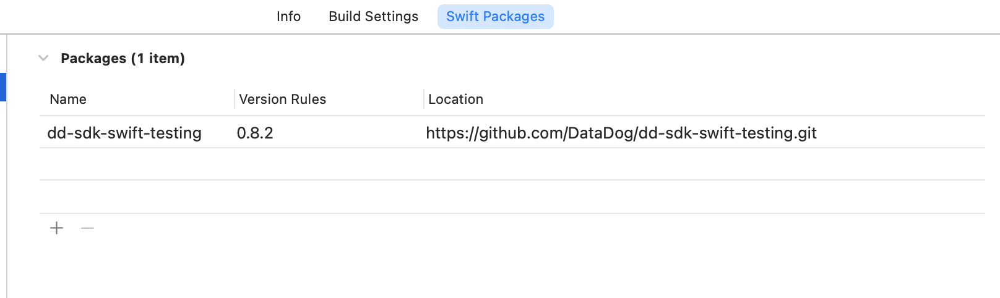
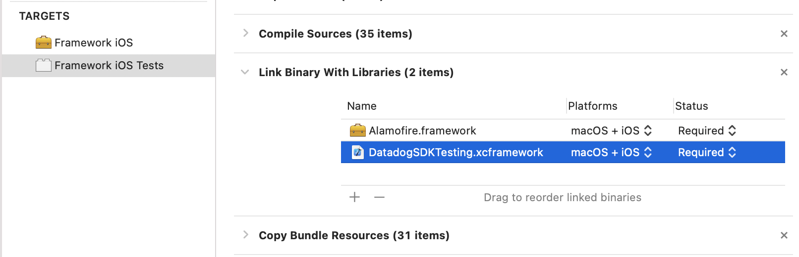
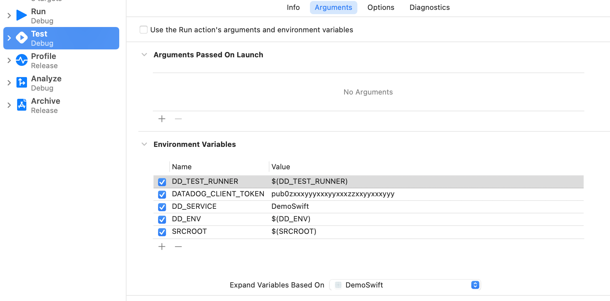

## Compatibility

Supported languages:
* Swift >= 5.2
* Objective-C >= 2.0

Supported platforms:
* iOS >= 12.0
* macOS >= 10.13
* tvOS >= 12.0

## Installing the Swift testing SDK

There are two ways of installing the testing framework:

### Via Swift Package Manager

1. Add `dd-sdk-swift-testing` package to your project. It is located at [`https://github.com/DataDog/dd-sdk-swift-testing`][1].

    

2. Link your test targets with the library `DatadogSDKTesting` from the package.

    

3. If you run UITests, also link the app running the tests with this library.

### Adding the framework to your project

1. Download and decompress `DatadogSDKTesting.zip` from the [release page][2].

2. Copy and link your test targets with the resulting XCFramework.

    

3. If you run UITests, also link the app running the tests with this library.

## Instrumenting your tests

### Configuring Datadog

To enable testing instrumentation, add the following environment variables to your test target. You must also select your main target in the `Expand variables based on:`  combo or `Target for Variable Expansion` if using test plans:

For UITests, environment variables need to be set only in the test target, because the framework automatically injects these values to the application.

You should set all these variables in your test target:

`DD_TEST_RUNNER`
: Enables or disables the instrumentation of tests. You should set this value to `$(DD_TEST_RUNNER)` so you can enable and disable test instrumentation with a environment variable 
**Default**: `(empty)` 
**Recommended**: `$(DD_TEST_RUNNER)` 
**Example**: `true`

`DATADOG_CLIENT_TOKEN`
: Your current Datadog client token. If you dont have one, you can create one [here][3] 
**Default**: `(empty)` 
**Examples**: `pub0zxxxyyyxxxyyxxxzzxxyyxxxyyy`

`DD_SERVICE`
: Name of the service or library under test. 
**Default**: `(Repository name)` 
**Example**: `my-marvelous-app`

`DD_ENV`
: Name of the environment where tests are being run. You should set this value to $(DD_ENV) so you can use an environment variable for setting it 
**Default**: `(empty)` 
**Recommended**: `$(DD_ENV)` 
**Examples**: `ci`, `local`

`SRCROOT`
: This is the path to the project SRCROOT environment variable. Best option is using `$(SRCROOT)` for the value, so it uses Xcode internal variable 
**Default**: `(empty)` 
**Recommended**: `$(SRCROOT)` 
**Example**: `/Users/ci/source/MyApp`

`DD_ENDPOINT`
: This is not needed if your company is using US endpoint 
**Default**: `us` 
**Examples**: `eu1`

### Configuring your CI service

You must also set environment variables for your CI service. Note that Git information is automatically collected if you use a simulator to perform your MacOS, iOS, or tvOS tests. However, If you do testing on physical devices, you must also set the additional Git-related environment variables. You can find a list of the CI services and the environment variables at the end of this document, in the section [CI Services](#CI-Services)

### Running tests

After installation, you can run your tests as you normally do, for example using the `xcodebuild test` command. Tests, network requests, and application logs will be instrumented automatically. You can pass your environment variables when running your tests in the CI, e.g:


DD_TEST_RUNNER=1 DD_ENV=ci xcodebuild -project "MyProject.xcodeproj" -scheme "MyScheme" -destination "platform=macOS,arch=x86_64" test


### UI tests

For UITests, both the test target and the application running from the UITests must link with the framework. Environment variables need to be set only in the test target, because the framework automatically injects these values to the application.

## Additional optional configuration

For the following configuration settings:
 - `Boolean` variables can use any of: `1`, `0`, `true`, `false`, `YES`, or `NO`
 - `String` list variables accept a list of elements separated by `,` or `;`

### Disabling auto-instrumentation

The framework automatically captures the most information possible, but for some situations or tests this can be counter-productive. You can disable some of the auto-instrumentation for all the tests by setting environment variables:

`DD_DISABLE_NETWORK_INSTRUMENTATION`
: Disables all network instrumentation (Boolean)

`DD_DISABLE_STDOUT_INSTRUMENTATION`
: Disables all `stdout` instrumentation (Boolean)

`DD_DISABLE_STDERR_INSTRUMENTATION`
: Disables all `stderr` instrumentation (Boolean)

`DD_DISABLE_SDKIOS_INTEGRATION`
: Disables integration with `dd-sdk-ios` logs and traces (Boolean)

`DD_DISABLE_CRASH_HANDLER`
: Disables crash handling and reporting. (Boolean)

<strong>Important</strong>: If you disable crash reporting, crashing tests won't be reported to the backend and won't appear as failures. If you need to disable crash handling for any of your tests, run it as a separate target, so you don't disable it for the rest of the tests.

### Network auto-instrumentation

For Network auto-instrumentation, you can configure these additional settings:

`DD_DISABLE_HEADERS_INJECTION`
: Disables all injection of tracing headers (Boolean)

`DD_INSTRUMENTATION_EXTRA_HEADERS`
: Specific extra headers that you want to log (String List)

`DD_EXCLUDED_URLS`
: URLs that you don't want to log or inject headers into (String List)

`DD_ENABLE_RECORD_PAYLOAD`
: Enables reporting a subset (1024 bytes) of the payloads in requests and responses (Boolean)

`DD_MAX_PAYLOAD_SIZE`
: Sets the maximum size reported from the payload. Default `1024` (Integer)

You can also disable or enable specific auto-instrumentation in some of the tests from Swift or Objective-C by importing the module `DatadogSDKTesting` and using the class: `DDInstrumentationControl`.

### CI Services

#### Jenkins

| Environment variable | Value             |
| -------------------- | ----------------- |
| `JENKINS_URL`        | `$(JENKINS_URL)`  |
| `WORKSPACE`          | `$(WORKSPACE)`    |
| `BUILD_TAG`          | `$(BUILD_TAG)`    |
| `BUILD_NUMBER`       | `$(BUILD_NUMBER)` |
| `BUILD_URL`          | `$(BUILD_URL)`    |
| `JOB_NAME`           | `$(JOB_NAME)`     |

Additional Git configuration for physical device testing:

| Environment variable | Value           |
| -------------------- | --------------- |
| `GIT_COMMIT`         | `$(GIT_COMMIT)` |
| `GIT_URL`            | `$(GIT_URL)`    |
| `GIT_BRANCH`         | `$(GIT_BRANCH)` |

#### CircleCI

| Environment variable       | Value                         |
| -------------------------- | ----------------------------- |
| `CIRCLECI`                 | `$(CIRCLECI)`                 |
| `CIRCLE_WORKING_DIRECTORY` | `$(CIRCLE_WORKING_DIRECTORY)` |
| `CIRCLE_BUILD_NUM`         | `$(CIRCLE_BUILD_NUM)`         |
| `CIRCLE_BUILD_URL`         | `$(CIRCLE_BUILD_URL)`         |
| `CIRCLE_WORKFLOW_ID`       | `$(CIRCLE_WORKFLOW_ID)`       |
| `CIRCLE_PROJECT_REPONAME`  | `$(CIRCLE_PROJECT_REPONAME)`  |

Additional Git configuration for physical device testing:

| Environment variable    | Value                      |
| ----------------------- | -------------------------- |
| `CIRCLE_SHA1`           | `$(CIRCLE_SHA1)`           |
| `CIRCLE_REPOSITORY_URL` | `$(CIRCLE_REPOSITORY_URL)` |
| `CIRCLE_BRANCH`         | `$(CIRCLE_BRANCH)`         |
| `CIRCLE_TAG`            | `$(CIRCLE_TAG)`            |

#### GitLab CI

| Environment variable | Value                |
| -------------------- | -------------------- |
| `GITLAB_CI`          | `$(GITLAB_CI)`       |
| `CI_PROJECT_DIR`     | `$(CI_PROJECT_DIR)`  |
| `CI_JOB_STAGE`       | `$(CI_JOB_STAGE)`    |
| `CI_JOB_NAME`        | `$(CI_JOB_NAME)`     |
| `CI_JOB_URL`         | `$(CI_JOB_URL)`      |
| `CI_PIPELINE_ID`     | `$(CI_PIPELINE_ID)`  |
| `CI_PIPELINE_IID`    | `$(CI_PIPELINE_IID)` |
| `CI_PIPELINE_URL`    | `$(CI_PIPELINE_URL)` |
| `CI_PROJECT_PATH`    | `$(CI_PROJECT_PATH)` |

Additional Git configuration for physical device testing:

| Environment variable | Value                  |
| -------------------- | ---------------------- |
| `CI_COMMIT_SHA`      | `$(CI_COMMIT_SHA)`     |
| `CI_REPOSITORY_URL`  | `$(CI_REPOSITORY_URL)` |
| `CI_COMMIT_BRANCH`   | `$(CI_COMMIT_BRANCH)`  |
| `CI_COMMIT_TAG`      | `$(CI_COMMIT_TAG)`     |
| `CI_COMMIT_MESSAGE`  | `$(CI_COMMIT_MESSAGE)` |

#### Travis

| Environment variable       | Value                         |
| -------------------------- | ----------------------------- |
| `TRAVIS`                   | `$(TRAVIS)`                   |
| `TRAVIS_BUILD_DIR`         | `$(TRAVIS_BUILD_DIR)`         |
| `TRAVIS_BUILD_ID`          | `$(TRAVIS_BUILD_ID)`          |
| `TRAVIS_BUILD_NUMBER`      | `$(TRAVIS_BUILD_NUMBER)`      |
| `TRAVIS_BUILD_WEB_URL`     | `$(TRAVIS_BUILD_WEB_URL)`     |
| `TRAVIS_JOB_WEB_URL`       | `$(TRAVIS_JOB_WEB_URL)`       |
| `TRAVIS_REPO_SLUG`         | `$(TRAVIS_REPO_SLUG)`         |
| `TRAVIS_PULL_REQUEST_SLUG` | `$(TRAVIS_PULL_REQUEST_SLUG)` |

Additional Git configuration for physical device testing:

| Environment variable         | Value                           |
| ---------------------------- | ------------------------------- |
| `TRAVIS_PULL_REQUEST_BRANCH` | `$(TRAVIS_PULL_REQUEST_BRANCH)` |
| `TRAVIS_BRANCH`              | `$(TRAVIS_BRANCH)`              |
| `TRAVIS_COMMIT`              | `$(TRAVIS_COMMIT)`              |
| `TRAVIS_TAG`                 | `$(TRAVIS_TAG)`                 |
| `TRAVIS_COMMIT_MESSAGE`      | `$(TRAVIS_COMMIT_MESSAGE)`      |

#### GitHub Actions

| Environment variable | Value                  |
| -------------------- | ---------------------- |
| `GITHUB_WORKSPACE`   | `$(GITHUB_WORKSPACE)`  |
| `GITHUB_REPOSITORY`  | `$(GITHUB_REPOSITORY)` |
| `GITHUB_RUN_ID`      | `$(GITHUB_RUN_ID)`     |
| `GITHUB_RUN_NUMBER`  | `$(GITHUB_RUN_NUMBER)` |
| `GITHUB_WORKFLOW`    | `$(GITHUB_WORKFLOW)`   |
| `GITHUB_SHA`         | `$(GITHUB_SHA)`        |

Additional Git configuration for physical device testing:

| Environment variable | Value                  |
| -------------------- | ---------------------- |
| `GITHUB_REF`         | `$(GITHUB_REF)`        |
| `GITHUB_HEAD_REF`    | `$(GITHUB_HEAD_REF)`   |
| `GITHUB_REPOSITORY`  | `$(GITHUB_REPOSITORY)` |

#### Buildkite

| Environment variable            | Value                              |
| ------------------------------- | ---------------------------------- |
| `BUILDKITE`                     | `$(BUILDKITE)`                     |
| `BUILDKITE_BUILD_CHECKOUT_PATH` | `$(BUILDKITE_BUILD_CHECKOUT_PATH)` |
| `BUILDKITE_BUILD_ID`            | `$(BUILDKITE_BUILD_ID)`            |
| `BUILDKITE_BUILD_NUMBER`        | `$(BUILDKITE_BUILD_NUMBER)`        |
| `BUILDKITE_BUILD_URL`           | `$(BUILDKITE_BUILD_URL)`           |
| `BUILDKITE_PIPELINE_SLUG`       | `$(BUILDKITE_PIPELINE_SLUG)`       |
| `BUILDKITE_JOB_ID`              | `$(BUILDKITE_JOB_ID)`              |

Additional Git configuration for physical device testing:

| Environment variable           | Value                             |
| ------------------------------ | --------------------------------- |
| `BUILDKITE_COMMIT`             | `$(BUILDKITE_COMMIT)`             |
| `BUILDKITE_REPO`               | `$(BUILDKITE_REPO)`               |
| `BUILDKITE_BRANCH`             | `$(BUILDKITE_BRANCH)`             |
| `BUILDKITE_TAG`                | `$(BUILDKITE_TAG)`                |
| `BUILDKITE_MESSAGE`            | `$(BUILDKITE_MESSAGE)`            |
| `BUILDKITE_BUILD_AUTHOR`       | `$(BUILDKITE_BUILD_AUTHOR)`       |
| `BUILDKITE_BUILD_AUTHOR_EMAIL` | `$(BUILDKITE_BUILD_AUTHOR_EMAIL)` |

#### Bitbucket pipelines

| Environment variable       | Value                         |
| -------------------------- | ----------------------------- |
| `BITBUCKET_CLONE_DIR`      | `$(BITBUCKET_CLONE_DIR)`      |
| `BITBUCKET_BUILD_NUMBER`   | `$(BITBUCKET_BUILD_NUMBER)`   |
| `BITBUCKET_PIPELINE_UUID`  | `$(BITBUCKET_PIPELINE_UUID)`  |
| `BITBUCKET_REPO_FULL_NAME` | `$(BITBUCKET_REPO_FULL_NAME)` |

Additional Git configuration for physical device testing:

| Environment variable       | Value                         |
| -------------------------- | ----------------------------- |
| `BITBUCKET_COMMIT`         | `$(BITBUCKET_COMMIT)`         |
| `BITBUCKET_GIT_SSH_ORIGIN` | `$(BITBUCKET_GIT_SSH_ORIGIN)` |
| `BITBUCKET_BRANCH`         | `$(BITBUCKET_BRANCH)`         |
| `BITBUCKET_TAG`            | `$(BITBUCKET_TAG)`            |

#### AppVeyor

| Environment variable     | Value                       |
| ------------------------ | --------------------------- |
| `APPVEYOR`               | `$(APPVEYOR)`               |
| `APPVEYOR_BUILD_FOLDER`  | `$(APPVEYOR_BUILD_FOLDER)`  |
| `APPVEYOR_BUILD_ID`      | `$(APPVEYOR_BUILD_ID)`      |
| `APPVEYOR_BUILD_NUMBER`  | `$(APPVEYOR_BUILD_NUMBER)`  |
| `APPVEYOR_REPO_TAG_NAME` | `$(APPVEYOR_REPO_TAG_NAME)` |
| `APPVEYOR_REPO_NAME`     | `$(APPVEYOR_REPO_NAME)`     |

Additional Git configuration for physical device testing:

| Environment variable                     | Value                                       |
| ---------------------------------------- | ------------------------------------------- |
| `APPVEYOR_REPO_COMMIT`                   | `$(APPVEYOR_REPO_COMMIT)`                   |
| `APPVEYOR_PULL_REQUEST_HEAD_REPO_BRANCH` | `$(APPVEYOR_PULL_REQUEST_HEAD_REPO_BRANCH)` |
| `APPVEYOR_REPO_BRANCH`                   | `$(APPVEYOR_REPO_BRANCH)`                   |
| `APPVEYOR_REPO_COMMIT_MESSAGE_EXTENDED`  | `$(APPVEYOR_REPO_COMMIT_MESSAGE_EXTENDED)`  |
| `APPVEYOR_REPO_COMMIT_AUTHOR`            | `$(APPVEYOR_REPO_COMMIT_AUTHOR)`            |
| `APPVEYOR_REPO_COMMIT_AUTHOR_EMAIL`      | `$(APPVEYOR_REPO_COMMIT_AUTHOR_EMAIL)`      |

#### Azure pipelines

| Environment variable             | Value                               |
| -------------------------------- | ----------------------------------- |
| `TF_BUILD`                       | `$(TF_BUILD)`                       |
| `BUILD_SOURCESDIRECTORY`         | `$(BUILD_SOURCESDIRECTORY)`         |
| `BUILD_BUILDID`                  | `$(BUILD_BUILDID)`                  |
| `BUILD_DEFINITIONNAME`           | `$(BUILD_DEFINITIONNAME)`           |
| `SYSTEM_TEAMPROJECTID`           | `$(SYSTEM_TEAMPROJECTID)`           |
| `SYSTEM_TEAMFOUNDATIONSERVERURI` | `$(SYSTEM_TEAMFOUNDATIONSERVERURI)` |
| `SYSTEM_JOBID`                   | `$(SYSTEM_JOBID)`                   |
| `SYSTEM_TASKINSTANCEID`          | `$(SYSTEM_TASKINSTANCEID)`          |

Additional Git configuration for physical device testing:

| Environment variable                     | Value                                       |
| ---------------------------------------- | ------------------------------------------- |
| `BUILD_SOURCEVERSION`                    | `$(BUILD_SOURCEVERSION)`                    |
| `BUILD_REPOSITORY_URI`                   | `$(BUILD_REPOSITORY_URI)`                   |
| `BUILD_SOURCEBRANCH`                     | `$(BUILD_SOURCEBRANCH)`                     |
| `SYSTEM_PULLREQUEST_SOURCECOMMITID`      | `$(SYSTEM_PULLREQUEST_SOURCECOMMITID)`      |
| `SYSTEM_PULLREQUEST_SOURCEBRANCH`        | `$(SYSTEM_PULLREQUEST_SOURCEBRANCH)`        |
| `SYSTEM_PULLREQUEST_SOURCEREPOSITORYURI` | `$(SYSTEM_PULLREQUEST_SOURCEREPOSITORYURI)` |
| `BUILD_SOURCEVERSIONMESSAGE`             | `$(BUILD_SOURCEVERSIONMESSAGE)`             |
| `BUILD_REQUESTEDFORID`                   | `$(BUILD_REQUESTEDFORID)`                   |
| `BUILD_REQUESTEDFOREMAIL`                | `$(BUILD_REQUESTEDFOREMAIL)`                |

#### Bitrise

| Environment variable   | Value                     |
| ---------------------- | ------------------------- |
| `BITRISE_SOURCE_DIR`   | `$(BITRISE_SOURCE_DIR)`   |
| `BITRISE_APP_TITLE`    | `$(BITRISE_APP_TITLE)`    |
| `BITRISE_BUILD_SLUG`   | `$(BITRISE_BUILD_SLUG)`   |
| `BITRISE_BUILD_NUMBER` | `$(BITRISE_BUILD_NUMBER)` |
| `BITRISE_BUILD_URL`    | `$(BITRISE_BUILD_URL)`    |

Additional Git configuration for physical device testing:

| Environment variable               | Value                                 |
| ---------------------------------- | ------------------------------------- |
| `GIT_REPOSITORY_URL`               | `$(GIT_REPOSITORY_URL)`               |
| `BITRISE_GIT_COMMIT`               | `$(BITRISE_GIT_COMMIT)`               |
| `BITRISE_GIT_BRANCH`               | `$(BITRISE_GIT_BRANCH)`               |
| `BITRISE_GIT_TAG`                  | `$(BITRISE_GIT_TAG)`                  |
| `GIT_CLONE_COMMIT_HASH`            | `$(GIT_CLONE_COMMIT_HASH)`            |
| `BITRISE_GIT_MESSAGE`              | `$(BITRISE_GIT_MESSAGE)`              |
| `GIT_CLONE_COMMIT_MESSAGE_SUBJECT` | `$(GIT_CLONE_COMMIT_MESSAGE_SUBJECT)` |
| `GIT_CLONE_COMMIT_MESSAGE_BODY`    | `$(GIT_CLONE_COMMIT_MESSAGE_BODY)`    |
| `GIT_CLONE_COMMIT_AUTHOR_NAME`     | `$(GIT_CLONE_COMMIT_AUTHOR_NAME)`     |
| `GIT_CLONE_COMMIT_AUTHOR_EMAIL`    | `$(GIT_CLONE_COMMIT_AUTHOR_EMAIL)`    |
| `GIT_CLONE_COMMIT_COMMITER_NAME`   | `$(GIT_CLONE_COMMIT_COMMITER_NAME)`   |
| `GIT_CLONE_COMMIT_COMMITER_EMAIL`  | `$(GIT_CLONE_COMMIT_COMMITER_EMAIL)`  |

## Further reading



[1]: https://github.com/DataDog/dd-sdk-swift-testing
[2]: https://github.com/DataDog/dd-sdk-swift-testing/releases
[3]:https://app.datadoghq.com/organization-settings/client-tokens
