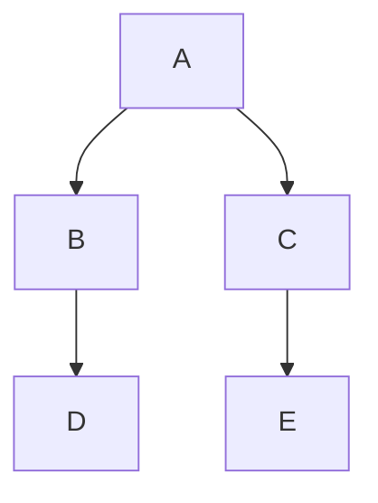

## Overview

Datadog Notebooks support Mermaid JS in any Markdown cell.
Mermaid is a JavaScript-based tool for creating diagrams and flowcharts in Markdown. Learn more about Mermaid in the [official documentation][1] or by using the [Mermaid live editor][2].

## Setup

To create a new diagram in your notebook:
1. Add a new text cell.
1. Select **Code Block** from inside the Markdown editor.
1. Select **Mermaid-JS**.

In the Datadog site, there is also a [Build Diagrams with Mermaid JS][3] template, which you can use to get started and to see diagram examples.

Use the [mermaid syntax][4] to build flowcharts, sequence diagrams, user journeys, gantt charts, and more.

## Example

Build a basic flowchart with a top down orientation:





Copy the example flowchart syntax into the mermaid code block. After you click **Done** the cell will populate the diagram.



[1]: https://mermaid.js.org/intro/
[2]: https://mermaid.live/
[3]: https://app.datadoghq.com/notebook/template/13/build-diagrams-with-mermaid-js
[4]: https://mermaid.js.org/syntax/classDiagram.html
