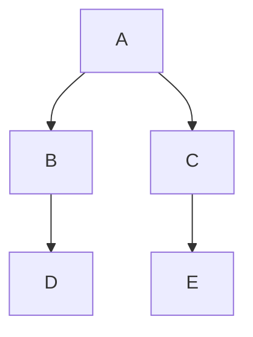

## Información general

Los notebooks de Datadog son compatibles con Mermaid JS en celdas de Markdown.
Mermaid es una herramienta basada en JavaScript que sirve para crear gráficos y diagramas de flujo en Markdown. Puedes obtener más información sobre Mermaid en la [documentación oficial][1] o utilizando el [editor dinámico Mermaid][2].

## Configuración

Para crear un nuevo diagrama en tu notebook:
1. Añade una nueva celda de texto.
1. Selecciona **Code Block** (Bloque de código) dentro del editor de Markdown.
1. Selecciona **Mermaid-JS**.

En la página de Datadog, también hay una plantilla para [crear diagramas con Mermaid JS][3] que puedes utilizar para empezar y ver ejemplos.

Utiliza la [sintaxis Mermaid][4] para crear diagramas de flujo, diagramas de secuencias, recorridos de los usuarios o gráficos de Gantt, entre otros.

## Ejemplo

Crea un diagrama de flujo básico con una orientación de arriba a abajo:





Copia la sintaxis del diagrama de flujo en el bloque de código Mermaid. Cuando hagas clic en **Done** (Listo), la celda rellenará el diagrama.



[1]: https://mermaid.js.org/intro/
[2]: https://mermaid.live/
[3]: https://app.datadoghq.com/notebook/template/13/build-diagrams-with-mermaid-js
[4]: https://mermaid.js.org/syntax/classDiagram.html