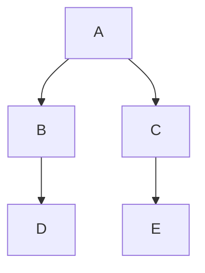

## Présentation

Datadog Notebooks prend en charge Mermaid JS dans n'importe quelle cellule Markdown.
Mermaid est un outil basé sur JavaScript pour créer des diagrammes et des organigrammes en Markdown. Pour en savoir plus sur Mermaid, consultez la [documentation officielle][1] ou utilisez l'[éditeur en direct de Mermaid][2].

## Implémentation

Pour créer un nouveau diagramme dans votre notebook :
1. Ajoutez une nouvelle cellule de texte.
1. Sélectionnez **Code Block** dans l'éditeur Markdown.
1. Sélectionnez **Mermaid-JS**.

Le site Datadog propose également un modèle [Build Diagrams with Mermaid JS][3] (en anglais), que vous pouvez utiliser pour bien débuter et voir des exemples de diagrammes.

Utilisez la [syntaxe mermaid][4] pour créer des organigrammes, des diagrammes de séquence, des parcours utilisateurs, des diagrammes de Gantt, etc.

## Exemple

Créer un organigramme simple avec une orientation descendante :





Copiez lʼexemple de syntaxe d'organigramme dans le bloc de code mermaid. Lorsque vous cliquez sur **Done**, la cellule remplit le diagramme.



[1]: https://mermaid.js.org/intro/
[2]: https://mermaid.live/
[3]: https://app.datadoghq.com/notebook/template/13/build-diagrams-with-mermaid-js
[4]: https://mermaid.js.org/syntax/classDiagram.html