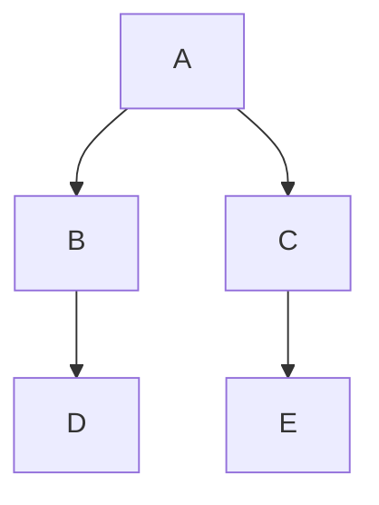

## 概要

Datadog ノートブックは、任意の Markdown セルで Mermaid JS をサポートします。
Mermaid は Markdown で図やフローチャートを作成するための JavaScript ベースのツールです。[公式ドキュメント][1]または [Mermaid ライブエディター][2]で Mermaid について詳しく知ることができます。

## セットアップ

ノートブックに新しいダイアグラムを作成するには
1. 新しいテキストセルを追加します。
1. Markdown エディター内から **Code Block** を選択します。
1. **Mermaid-JS** を選択します。

Datadog のサイトには、[Build Diagrams with Mermaid JS][3] というテンプレートもあり、これを利用すると、図のサンプルを見ることができます。

[Mermaid 構文][4]を使って、フローチャート、シーケンス図、ユーザージャーニー、ガントチャートなどを作成することができます。

## 例

トップダウンで基本的なフローチャートを構築します。





フローチャートの例の構文を Mermaid コードブロックにコピーします。**Done** をクリックすると、セルに図が入力されます。



[1]: https://mermaid.js.org/intro/
[2]: https://mermaid.live/
[3]: https://app.datadoghq.com/notebook/template/13/build-diagrams-with-mermaid-js
[4]: https://mermaid.js.org/syntax/classDiagram.html
