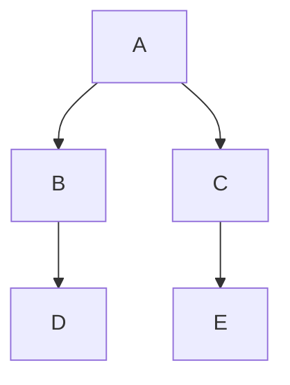

## 개요

Datadog Notebook은 모든 Markdown 셀에서 Mermaid JS를 지원합니다.
Mermaid는 Markdown에서 다이어그램과 흐름도를 만들기 위한 자바스크립트(JavaScript) 기반 도구입니다. [공식 문서][1] 또는 [Mermaid 라이브 편집기][2]를 사용하여 Mermaid에 대해 자세히 알아보세요.

## 설정

노트북에서 새로운 다이어그램을 생성하는 방법:
1. 새로운 텍스트 셀을 추가합니다.
1. Markdown 편집기 내부에서 **코드 블록**을 선택합니다.
1. **Mermaid-JS**를 선택합니다.

Datadog 사이트에는 다이어그램을 시작하고 예시를 확인할 수 있도록 [Mermaid JS를 사용한 다이어그램 빌드][3] 템플릿도 제공합니다.

[Mermaid 구문][4]을 사용하여 순서도, 시퀀스 다이어그램, 사용자 여정, 간트(gantt) 차트 등을 빌드하세요.

## 예시

위에서 아래 방향으로 기본 흐름도 빌드:





예제 흐름도 구문을 Mermaid 코드 블록에 복사합니다. **완료**를 클릭하면 셀이 다이어그램을 채웁니다.



[1]: https://mermaid.js.org/intro/
[2]: https://mermaid.live/
[3]: https://app.datadoghq.com/notebook/template/13/build-diagrams-with-mermaid-js
[4]: https://mermaid.js.org/syntax/classDiagram.html